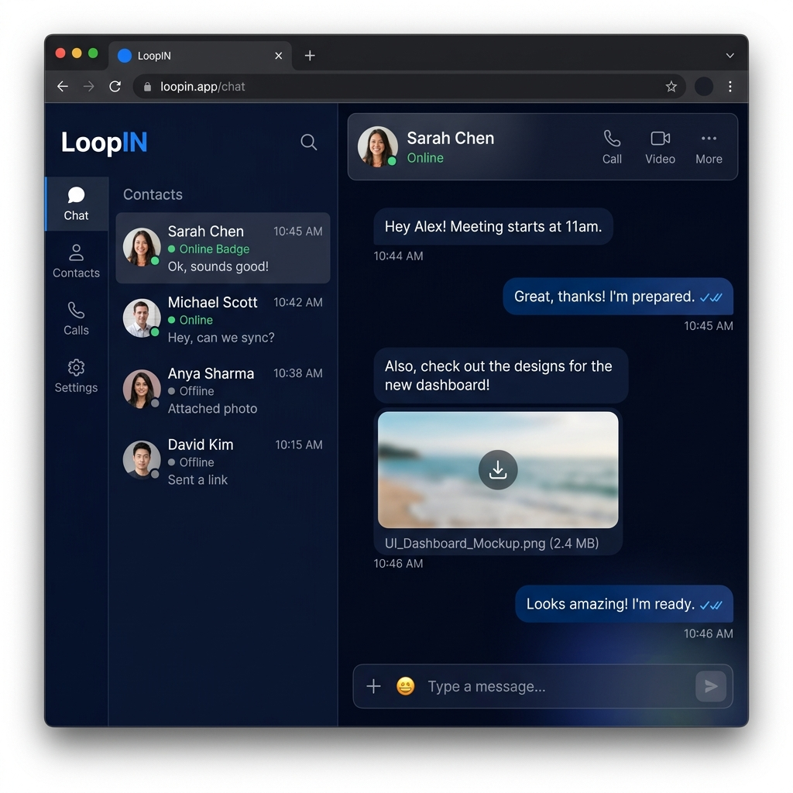
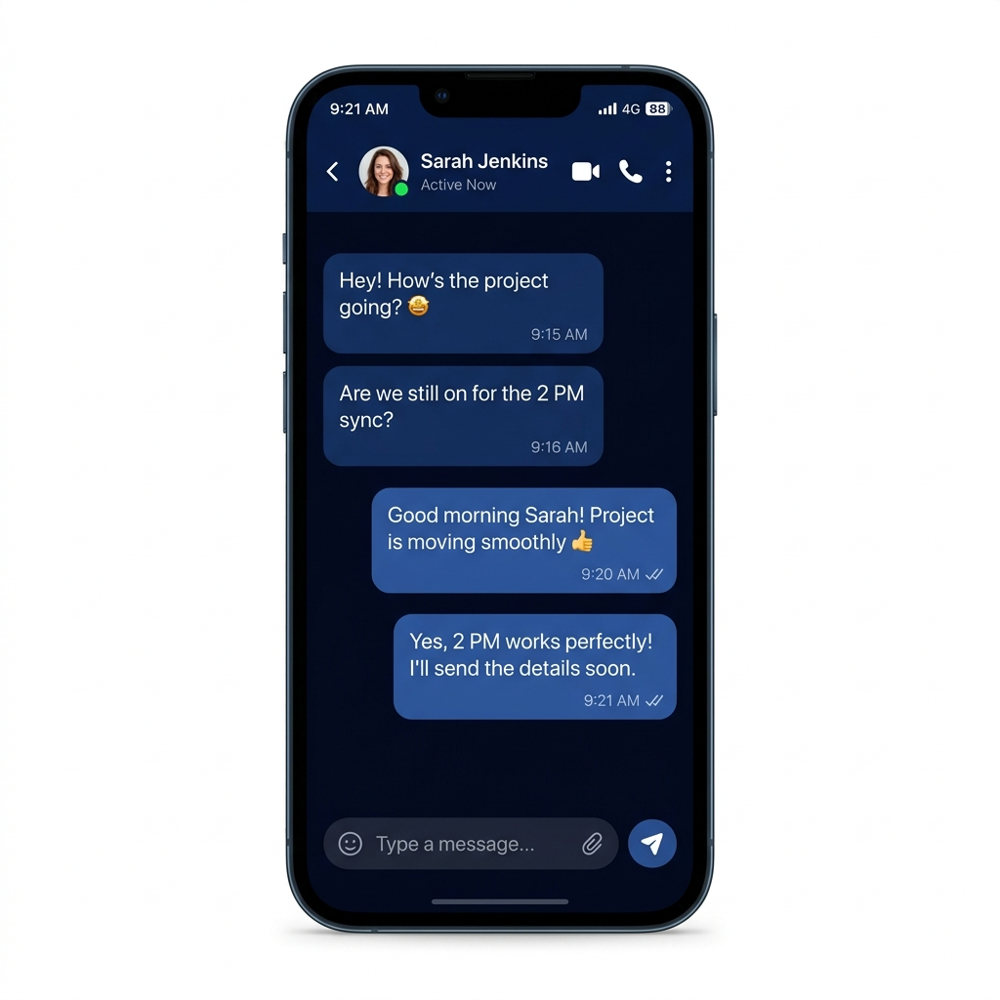

# 🔁 LoopIN - Real-Time Messaging & Photo Sharing Platform


**LoopIN** is a modern, high-performance real-time messaging web application featuring a WhatsApp-inspired **Midnight Deep Navy Blue UI (`#03081C`)**, lossless WebP image sharing, voice notes recording, real-time message reactions, group chat management, privacy-first friend requests, real-time message/chat deletion, and mobile responsive optimization.

---

## 🖼️ Application Screenshots

### 💻 Desktop Web Browser Interface


### 📱 Mobile Smartphone Interface


---

## ✨ Key Features

### 💬 1. Real-Time Chat & Messaging
* **Socket.io WebSockets Integration**: Instant message delivery with room-level socket events.
* **Double Checkmark Read Status**: WhatsApp-style double checkmarks (`✓✓`) in sky blue next to sent message timestamps.
* **Top Conversation Sorting**: Chat rooms with the most recent messages automatically bump to the top of your sidebar list in real-time.
* **Unread Notifications**: Red sidebar badge counters, Web Audio API chime notifications, and dynamic browser tab title indicators (`(1) New Message - LoopIN`).

### 🔐 2. End-to-End Encryption (E2EE)
* **Web Crypto API Engine**: Native browser `window.crypto.subtle` AES-256-GCM symmetric payload encryption with RSA-OAEP 2048-bit identity key pairs.
* **Zero-Knowledge Server & Storage**: Message text, shared photo attachments, and voice notes are encrypted before leaving the client browser. Database and WebSockets only see encrypted ciphertexts.
* **Visual E2EE Indicators**: Green security shields (`🔒 E2EE`) in active chat headers and lock icons next to message timestamps.

### 🎙️ 3. Voice Notes Recording & Playback
* **Audio Recorder & Waveform UI**: Record voice notes directly from the input bar with live duration counters and visualizers.
* **In-App Audio Player**: Sleek voice player with play/pause toggles and custom scrub bars embedded seamlessly in message bubbles.

### 😃 4. Message Emoji Reactions
* **Quick Emoji Picker Bar**: Hover or tap any message to react with top emojis (❤️ 👍 😂 🔥 😮 😢).
* **Live Reaction Badges**: Displays aggregated reaction badges under messages updated in real-time across connected clients via WebSockets.

### 👥 5. Group Chat Management & Roles
* **Group Creation & Customization**: Create custom group chats with group name, description, avatar upload, and member selection.
* **Admin & Member Roles**: Dedicated group permission controls for admins to add/remove members and update group settings.

### 🗑️ 6. Real-Time Room & Message Deletion
* **Delete Individual Messages**: Senders can delete specific sent messages 🗑️ with real-time room broadcasts (`delete_message`).
* **Delete Entire Chat Rooms**: Delete active chat rooms from the sidebar or header menu 🗑️ with real-time socket updates (`delete_conversation`).

### 📷 7. Lossless WebP Image Sharing & 1:1 Avatar Cropper
* **WebP Lossless Compression**: Client-side HTML5 Canvas compressor converts images to 100% quality WebP format before uploading to Supabase Storage.
* **1:1 Cover Aspect Ratio Cropper**: Automatic cover scaling (`Math.max(280 / w, 280 / h)`), rule-of-thirds grid framing guides, touch drag gestures, and high-res 512x512 output.
* **Full-Screen Lightbox Preview**: Click any shared image attachment or user avatar to view in full-resolution lightbox mode.

### ⏱️ 8. 15-Second Message Editing
* Senders can edit text messages within a **15-second countdown window**.
* Live timer counts down (`Edit (15s)` ➔ `Edit (1s)`) and updates rooms in real time via WebSockets.

### 🛡️ 9. Friend Requests & Privacy
* **Privacy-First Search**: Search users strictly by `username` and `avatarUrl` without exposing email addresses.
* **Request System**: Send, accept, or decline pending friend requests. 1-on-1 direct messaging rooms automatically unlock upon request acceptance.

### 🔒 10. Authentication & Security
* **Unique Username Enforcement**: Strict case-insensitive username uniqueness checks.
* **Strong Password Policy**: All passwords must contain min 6 chars, 1 uppercase letter (`A-Z`), 1 lowercase letter (`a-z`), 1 number (`0-9`), and 1 special character (`!@#$%^&*`).
* **Forgot Password Workflow**: 6-digit OTP code reset system with 15-minute expiration tracking.

### 📱 11. Responsive Mobile Design & Resilient Cleanup
* **Single-Pane View Switching**: Mobile screens (`<= 768px`) automatically switch between full-screen Conversations Drawer and Chat Thread with 1-tap back arrow ⬅️.
* **AbortController Race Condition Protection**: React `useEffect` hooks include `AbortController` cleanup functions to safely cancel pending HTTP requests when rapidly switching chat rooms.

---

## 🛠️ Technology Stack

* **Frontend**: React (Vite), TypeScript, Web Crypto API (`SubtleCrypto`), Lucide React Icons, HTML5 Canvas API, Web Audio API, MediaRecorder API.
* **Backend**: Node.js, Express, Socket.io, Bcrypt, JWT (`jsonwebtoken`), Multer.
* **Database & Storage**: Supabase PostgreSQL & Supabase Storage Bucket (`chat-images`).

---

## 🚀 Getting Started

### 1. Prerequisites
* **Node.js**: v18.0.0 or higher
* **npm**: v9.0.0 or higher
* **Supabase Account**: Service Role Key & Storage Bucket created

### 2. Environment Configuration

Create a `.env` file in the `server/` directory:
```env
PORT=5000
JWT_SECRET=your_super_secret_jwt_key
SUPABASE_URL=https://your-project.supabase.co
SUPABASE_SERVICE_ROLE_KEY=your_supabase_service_role_key
```

Create a `.env` file in the `client/` directory:
```env
VITE_API_URL=http://localhost:5000/api
VITE_SOCKET_URL=http://localhost:5000
```

### 3. Database Migration
Execute the provided SQL migration scripts in your Supabase SQL Editor in order:
1. `supabase_migration.sql` (User, Conversation, ConversationMember, Message tables + Storage Bucket)
2. `supabase_friend_migration.sql` (FriendRequest table + indexes)
3. `supabase_password_reset_migration.sql` (PasswordReset table + OTP indexes)
4. `supabase_group_migration.sql` (Group description, avatar, and member roles)
5. `supabase_reaction_migration.sql` (MessageReaction table for emoji reactions)
6. `supabase_voice_migration.sql` (Voice Notes `audioUrl` column support)
7. `supabase_e2ee_migration.sql` (End-to-End Encryption RSA public keys & ciphertext fields)

### 4. Running Development Servers

Start the backend server:
```bash
cd server
npm install
npm run dev
```

Start the frontend client:
```bash
cd client
npm install
npm run dev
```

Open your browser at **`http://localhost:5173`** to access **LoopIN**!

---

## 📄 License
This project is open-source under the MIT License.

